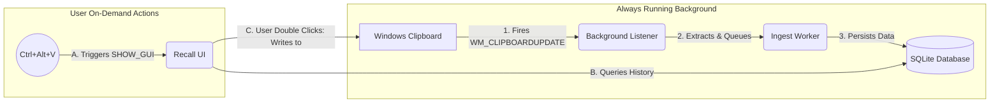

# Recall

*If you are looking for an actually good, production-ready clipboard manager, I highly recommend just using [Ditto](https://ditto-cp.sourceforge.io/). It's what I use daily.* 

If you want to see a 2-day weekend MVP, keep reading.

## ⚠️ Disclaimer
This project is a 100% **"vibe-coded"** application. It was meant to serve as a trial-by-fire to stress-test CLI-based AI coding models. For this project, `gemini-cli` was primarily used, which was... *ok, not too great, by any means*. The code is functional, but the process was an experiment in autonomous generation rather than strict software engineering.

## What it is & Why it was built
I use Ditto every day and eventually thought: *"Why the hell not? Doesn't seem so hard to build an MVP of this."*

The core logic of a clipboard manager is surprisingly simple:
1. Find the signal that the OS (in my case, Windows) fires when a copy action is executed.
2. Subscribe to it.
3. Maintain a local database to store the payloads.
4. Add a UI on top of it.
5. Ensure there are two distinct threads so the UI and the "backend" don't block one another.

And that's pretty much it. It really isn't that hard to get off the ground.

**Why Python?** Python was chosen purely for MVP development speed. I am fully aware that for an OS-level background service handling system hooks and memory, languages like C++, Rust, or C# are objectively better alternatives. But for a rapid weekend experiment, Python got the job done fast.

## Features
- **Text & Image Support:** Automatically captures text and images (generating lightweight UI thumbnails for the latter).
- **Context Actions:** Right-click items to **Pin** them (protecting them from auto-cleanup) or **Delete** them manually.
- **Search:** Instantly filter through your clipboard history.
- **Configurable History Limit:** Retains the last 200 items by default. *(Note: You can configure this to be higher, but do so at your own risk. Storing hundreds of high-resolution PNG blobs in SQLite can cause the database file size and memory footprint to grow rapidly).*

## Architecture

To keep the application responsive, it is split into two primary layers communicating via thread-safe queues.



## Technical Notes & Quirks

*   **Win32 Integration:** Interacting with the Windows Clipboard requires listening to the `WM_CLIPBOARDUPDATE` message. You have to choose between `pywin32` (which provides nicer wrappers but feels a bit dated) and raw `ctypes` (which is boilerplate-heavy). I used a mix, eventually creating a hidden Windows Message Pump just to catch OS signals.
*   **CustomTkinter:** I am experienced in PyQt, but I wanted to see what `customtkinter` had to offer. It's incredibly fast to stand up and looks modern out of the box, which made it perfect for a rapid MVP.
*   **The Deployment Saga:** I eventually tried to package this app into a standalone `.exe` using PyInstaller. The compilation succeeded beautifully! However, Windows Smart App Control instantly blocked the executable because it wasn't signed with an expensive Code Signing Certificate. 
    *   *The Pivot:* I tried writing a lightweight `.bat` script to automate installing it locally via a Python virtual environment and setting up a Desktop shortcut. 
    *   *The Defeat:* After battling Batch parsing errors and PowerShell encoding quirks, I decided to just drop the installer entirely. No one will ever read this project anyway, and no one will ever use it - so if you want to run it, just use Python from source!

## How to run (from source)
Make sure you have Python 3.11+ and `uv` installed.

```bash
uv sync
uv run recall
```
*Press `Ctrl+Alt+V` to open the UI.*